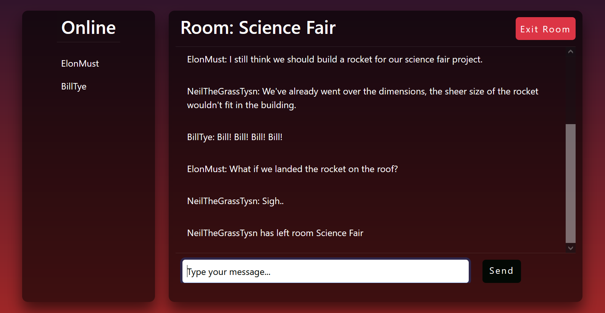

# Realtime-chat-room-app

## Description

This project is a high-performance chatroom application designed to facilitate real-time, bidirectional communication. Users can create chatroom groups tailored to specific purposes, protected by secure room codes, ensuring privacy and exclusivity. Built with scalability in mind, the application can handle a significant number of concurrent users, making it ideal for both professional project-based collaborations and casual group conversations. The primary goal of this project is to deliver secure, seamless real-time connectivity for diverse user needs, ranging from productive teamwork to casual chats with friends. 

## Features

- User authentication
- Responsive design built with React and Bootstrap
- API constructed with Flask
- Real time bidirectional communication implemented using Flask-SocketIO 

## Live Demo

https://dw-realtime-chatroom-app.netlify.app/
 

## Screenshots

 

## Installation

### Clone the repo:

`git clone https://github.com/Darrius-W/Realtime-chat-room-app.git`

### Navigate to the directory:

`cd Realtime-chat-room-app`

### Install dependencies:

`pip install -r requirements.txt`

### Navigate to the client folder:

`cd client`

### Start the front end:

npm start

### Navigate to the server folder:

`cd server`

Start the backend:
`flask --app server.py run`
 

## Usage

### 1. Sign In or Register

Begin by signing in with your account. If you’re new, create an account to get started.

### 2. Access the Room Selection Page

After logging in, you will be directed to the room selection page. Here, you can join a specific room by entering its room code.

### 3. Join the Main Chatroom

Upon entering the correct room code, you’ll be navigated to the main chatroom page. This page will display:

- A list of all online members in the room.
- The current room details for easy reference.
- The chat window, where you can start interacting with other members.

### 4. Start Communicating

Enjoy real-time discussions with group members in a secure and user-friendly environment. 

## Technologies Used

- Flask
- React
- Bootstrap
- SQLAlchemy
- Postgresql
